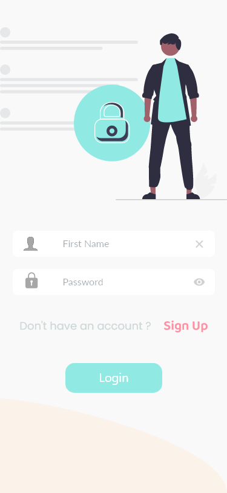
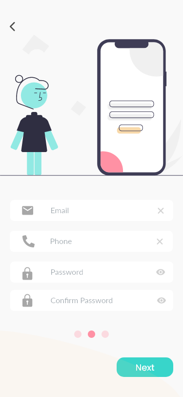
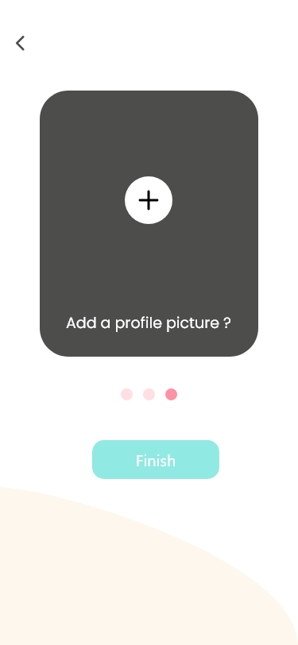

# helph
Helph - GADS Community Project - Health Team 13

## Project Overview 
* Patients in most African countries are faced with the problem of easily getting the drugs prescribed from the hospital at the right time.
This is mostly because of the lack of information concerning pharmacies which have these drugs in their current stock. In addition to the
above mentioned problem, older people find it difficult to take their drugs at the right time since they have to be reminded to do so.

## Project Goal
* The goal of this project is to design and develop an android application to solve the above mentioned problems. This application is meant
to help patients easily have access to their prescribed drugs by directing them to nearby pharmacies which have the drugs in their current stock,
in addition to that, the application will help remind patients to take their drugs using alarm notifications.

## Main Functionalities
- Patients need to authenticate before getting access to the application
- List nearby pharmacies
- List Drugs categorized under illnesses
- Search for a particullar drug
- Call a pharmacy or send whatsapp message to check availability of a drug
- Navigate to a particullar pharmacy with the help of google maps
- Have an alarm notification remind them when they have to take their
drugs

## Application Charecteristics
- Have a splash screen
- Have onboarding or walkthrough screen
- Have authentication screens
- Have a bottom navigation bar with three tabs:
 Home Tab(The main screen of the application)
 My drugs Tab (Where the user add drugs to his/ her list)
 My Account Tab (Where the user can view and modify his/ her
information)
- Have a drug detail screen
- Have a pharmacy detail screen
- Have a Map screen which helps user navigate to a particular pharmacy

## Application Architecture
- Clean architecture will be used for this project

## 📸 ScreenShots

